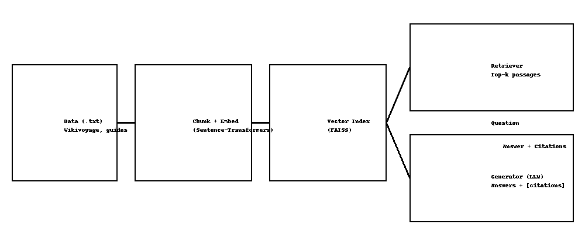

# TravelMate — RAG Chatbot for Travel Guides

TravelMate is a Retrieval-Augmented Generation (RAG) project we built to help answer travel-related questions using real guide information. Instead of relying only on a language model, the system searches through travel text files (like city guides) and uses those snippets to generate grounded answers with citations.


## ✨ What's included
- RAG pipeline: break text into chunks → embed them → build a FAISS index → search relevant passages → generate an answer with the retrieved context.
- Streamlit web app: a simple UI where you can ask questions, browse retrieved passages, and adjust the top-k value.
- Evaluation tools: basic scripts (evaluate.py + eval/questions.jsonl) to check precision@k and retrieval speed.
- Sample data: short travel notes for cities like Paris, Tokyo, London, Rome, Bangkok, and New York (we’ll replace these with cleaned Wikivoyage data later).
---

## 🔧 Quick Start

```# Create a virtual environment
python -m venv .venv
.venv\Scripts\Activate.ps1

# Install
pip install -r requirements.txt

## Build the FAISS index
python ingest.py --data_dir ./data --index_dir ./index --chunk_size 500 --chunk_overlap 50

## CLI question
python query_cli.py --index_dir ./index --question "How do I get from CDG to central Paris?"
## Run the Streamlit app
streamlit run app_streamlit.py

```

### Optional: enable LLM answers
```bash
cp .env.example .env
# here OPENAI_API_KEY
```
---

## 🧪 Evaluation (precision@k + latency)

Edit `eval/questions.jsonl` to add your own QA pairs. Then run:
``bash
python evaluate.py --index_dir ./index --k 5
```
- **Precision@k** — how often the correct passage appears in the top-k results
- **Latency** — average retrieval time in milliseconds

> This evaluation is basic and mainly for quick testing. You can add more questions later if you want a more complete assessment.
---

## 🧱 Project Layout

```
travelmate_project_full/
  assets/architecture.png
  data/
    paris.txt, tokyo.txt, london.txt, rome.txt, bangkok.txt, newyork.txt
  eval/questions.jsonl
  ingest.py
  query_cli.py
  evaluate.py
  app_streamlit.py
  travelmate/
    __init__.py
    chunking.py
    embeddings.py
    index_store.py
    generator.py
    utils.py
  requirements.txt
  .env.example
  README.md
```

---

## 🗺️ Roadmap
1) Replace sample /data with curated, cleaned text from Wikivoyage & official guides.
2) Expand `eval/questions.jsonl` to 25–50 questions.
3) Improve prompts and try stronger embedding models.
4) Add HTML cleaning & metadata tagging (city/section) in `utils.py`.
5) (Optional) UI polish: city filter, file uploader, live re-indexing.
